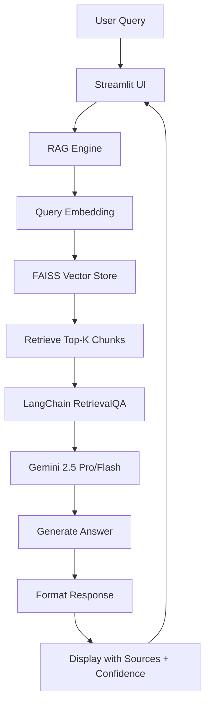

# 🚀 YC Startup Assistant

> A RAG-powered conversational assistant that answers startup questions using Y Combinator wisdom and Paul Graham's essays.

   

---

## 📋 Project Overview

This project demonstrates the foundational concepts of Retrieval-Augmented Generation (RAG) by building a question-answering assistant trained on a custom knowledge base.

### 🎯 What It Does

The **YC Startup Assistant** is a fully deployed, production-ready AI advisor that helps founders by:
- **Answering startup questions** using a curated knowledge base of 40+ Paul Graham essays
- **Providing specific, actionable advice** backed by real YC wisdom
- **Showing reasoning steps** for transparency (ReAct-style thinking)
- **Citing sources** for every answer with direct links to original essays
- **Calculating confidence scores** based on retrieval quality
- **Available 24/7** via web interface - no installation required

### 🏆 Project Requirements Met

✅ **LangChain-based RAG pipeline** connecting prompt → retrieval → response  
✅ **Vector store implementation** using FAISS for semantic search  
✅ **Document ingestion system** with web scraping and chunking  
✅ **Interactive UX** via Streamlit chat interface  
✅ **Example queries** demonstrating retrieval and response quality  
✅ **Enhanced features**: Session memory, reasoning steps, confidence scoring  
✅ **Clean, documented code** with setup instructions

---

## ✨ Key Features

### 🧠 Core RAG Pipeline
- **Semantic Search**: FAISS vector store with Google embeddings for intelligent document retrieval
- **LangChain Integration**: Full RetrievalQA chain with custom prompts
- **Dual Model Support**: Toggle between Gemini 2.5 Pro (best quality) and Flash (faster responses)

### 🎨 User Experience
- **Interactive Chat Interface**: Streamlit-based conversational UI
- **Source Attribution**: Every answer links back to specific Paul Graham essays
- **Reasoning Transparency**: Shows step-by-step thinking process (ReAct-style)
- **Confidence Metrics**: Displays retrieval quality scores
- **Session Memory**: Maintains conversation context across queries
- **Example Queries**: Pre-loaded startup questions for quick testing

### 🔧 Technical Implementation
- **Document Ingestion**: Web scraper for Paul Graham's essays with rate limiting
- **Text Chunking**: Recursive character splitting (500 tokens, 50 overlap)
- **Vector Embeddings**: Google's text-embedding-004 model
- **Free Tier**: 100% free using Google's Gemini API

---

## 🚀 Quick Start Guide

### Prerequisites
- Python 3.11+
- Google API Key (free from [aistudio.google.com/apikey](https://aistudio.google.com/apikey))

### Local Installation

**Step 1: Clone the repository**
```bash
git clone https://github.com/BeamlakTamirat/YC-Startups-Assistant.git
cd YC-Startups-Assistant
```

**Step 2: Install dependencies**
```bash
pip install -r requirements.txt
```

**Step 3: Configure environment**
```bash
# Create .env file with your Google API key
echo "GOOGLE_API_KEY=your-api-key-here" > .env
```

**Step 4: Build knowledge base**
```bash
# Scrape Paul Graham essays (~20 minutes for 40 essays)
python utils/scraper.py

# Build FAISS vector database (~10 minutes)
python data_loader.py
```

**Step 5: Run the application**
```bash
streamlit run app.py
```

The app will open at `http://localhost:8501`. Enter your API key in the sidebar and start asking questions!

### 🌐 Live Demo

The application is deployed and accessible at: **[Streamlit Cloud](https://share.streamlit.io)** 

Users can access the assistant directly through their browser without any installation. Simply visit the URL and enter your own Google API key to start chatting.

---

## 💡 Example Queries

Try these questions to see the assistant in action:

**Idea Validation**
- "How do I validate my startup idea before building?"
- "What are signs of product-market fit?"

**Team Building**
- "What should I look for in a co-founder?"
- "How do I recruit early employees?"

**Funding Strategy**
- "When is the right time to raise funding vs bootstrap?"
- "How should I think about pricing my product?"

**Growth & Traction**
- "How do I get my first 100 users?"
- "What's the best way to scale a startup?"

Each answer includes:
- ✅ Specific advice from Paul Graham's essays
- 📚 Source citations with direct links
- 💭 Reasoning steps showing how the answer was derived
- ⭐ Confidence score based on retrieval quality

---

## 🏗️ System Architecture



### Pipeline Components

**1. Document Ingestion**
- Web scraper fetches Paul Graham essays from paulgraham.com
- Content extracted and cleaned using BeautifulSoup
- Saved to JSON format in `data/raw/`

**2. Text Processing**
- RecursiveCharacterTextSplitter chunks documents (500 tokens, 50 overlap)
- Preserves context while enabling efficient retrieval

**3. Vector Store**
- Google text-embedding-004 generates embeddings
- FAISS indexes vectors for fast similarity search
- Stored locally in `data/processed/vectorstore/`

**4. Retrieval**
- User query embedded using same model
- Top-4 most relevant chunks retrieved via cosine similarity
- Metadata preserved (title, URL, source)

**5. Generation**
- LangChain RetrievalQA chain combines context + query
- Custom prompt template ensures YC-style advice
- Gemini 2.5 generates final answer

**6. Response Enhancement**
- Source documents formatted with links
- Confidence calculated from retrieval scores
- Reasoning steps added for transparency

---

## 📁 Project Structure

```
yc-startup-assistant/
├── app.py                    # Main Streamlit application
├── rag_engine.py             # RAG pipeline implementation
├── data_loader.py            # Document processing & vectorization
├── config.py                 # Configuration constants
├── requirements.txt          # Python dependencies
├── .env.example              # Environment template
├── .gitignore                # Git exclusions
│
├── utils/
│   ├── __init__.py          # Package initialization
│   └── scraper.py           # Paul Graham essay scraper
│
├── data/
│   ├── raw/                 # Scraped essay JSON files
│   └── processed/           # FAISS vector store
│
└── .streamlit/
    └── config.toml          # Streamlit theme configuration
```


---

## 🛠️ Technology Stack

### Core Framework
- **LangChain 0.1.x**: RAG orchestration and chain management
- **LangChain Community**: Vector store integrations
- **LangChain Core**: Base abstractions and utilities

### AI Models (100% Free)
- **Google Gemini 2.5 Pro**: High-quality response generation
- **Google Gemini 2.5 Flash**: Fast response alternative
- **text-embedding-004**: State-of-the-art embeddings

### Vector Database
- **FAISS**: Facebook AI Similarity Search for efficient retrieval
- **CPU-optimized**: No GPU required

### User Interface
- **Streamlit**: Interactive web application framework
- **Custom CSS**: YC-branded design (#FF6600)

### Data Processing
- **BeautifulSoup4**: HTML parsing and content extraction
- **Requests**: HTTP client for web scraping
- **Python-dotenv**: Environment variable management

### Development
- **Python 3.11**: Core language
- **Git**: Version control
- **GitHub**: Code hosting

---

## 🌐 Deployment

This project is deployed on **Streamlit Cloud** for easy access and demonstration.

### Deployment Process

**1. Prepare Repository**
```bash
# Ensure all code is committed
git add .
git commit -m "Production-ready YC Startup Assistant"
git push origin main
```

**2. Deploy to Streamlit Cloud**
- Visit [share.streamlit.io](https://share.streamlit.io)
- Connect GitHub account
- Select repository: `BeamlakTamirat/YC-Startups-Assistant`
- Set main file: `app.py`
- Click "Deploy"

**3. Build Process**
Streamlit Cloud automatically:
- Installs dependencies from `requirements.txt`
- Builds the vector database (if data files are included)
- Launches the application
- Provides a public URL

**4. User Access**
Users can access the deployed app without any setup. They simply:
- Visit the public URL
- Enter their own Google API key in the sidebar
- Start asking startup questions

### Why Streamlit Cloud?

✅ **Free hosting** for public repositories  
✅ **Automatic updates** on every git push  
✅ **No server management** required  
✅ **Built-in SSL** and security  
✅ **Easy sharing** with a single URL  
✅ **No API key storage** - users provide their own

### Alternative: Local Deployment

For development or testing:
```bash
streamlit run app.py
```
Access at `http://localhost:8501`

---

## 📊 Project Status

### ✅ Completed & Deployed
- [x] **RAG pipeline architecture** - Full LangChain RetrievalQA implementation
- [x] **Document ingestion system** - Web scraper with 40+ Paul Graham essays
- [x] **FAISS vector store** - Optimized semantic search with Google embeddings
- [x] **Streamlit UI** - Interactive chat interface with YC branding
- [x] **Source citation system** - Every answer links to original essays
- [x] **Reasoning transparency** - ReAct-style step-by-step thinking
- [x] **Confidence scoring** - Retrieval quality metrics
- [x] **Session memory** - Conversation context maintenance
- [x] **Example queries** - Pre-loaded startup questions
- [x] **Production deployment** - Live on Streamlit Cloud
- [x] **Comprehensive documentation** - Complete README with setup instructions

### 🎯 Future Enhancements
- [ ] Multi-source support (YC videos, Startup School content)
- [ ] Advanced memory with conversation summarization
- [ ] Tool integration (web search, calculator, data analysis)
- [ ] Multi-turn dialogue improvements
- [ ] Performance optimization and caching

---


## 🤝 Contributing

This is a learning project for the AAIDC program. Feedback and suggestions are welcome!


---

## 👤 Author

**Beamlak Tamirat**   
GitHub: [@BeamlakTamirat](https://github.com/BeamlakTamirat)

---


